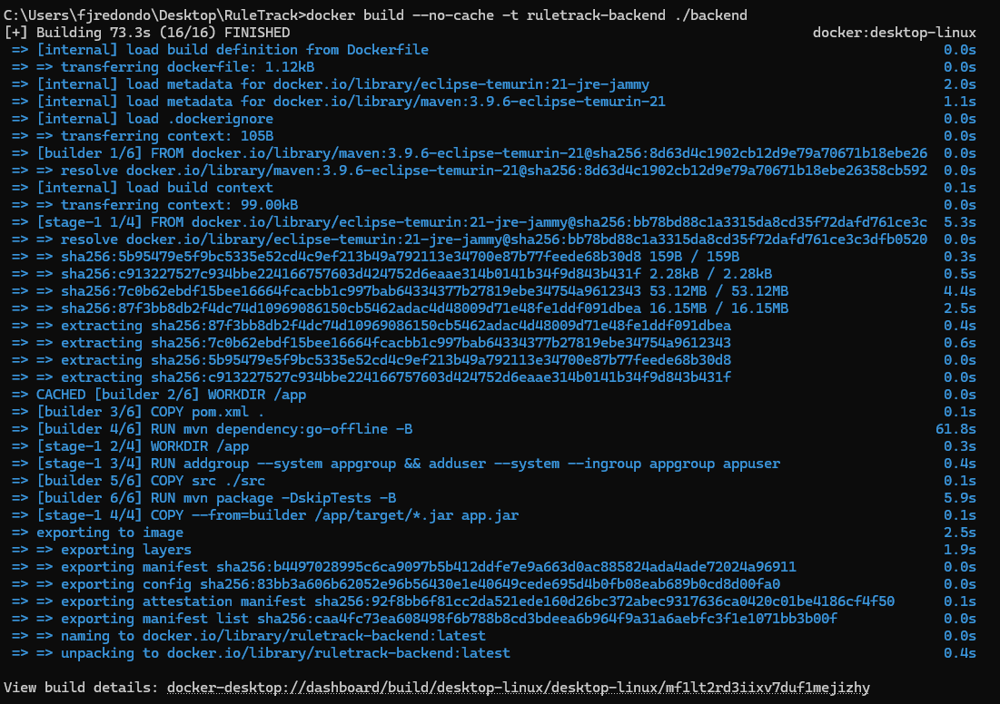
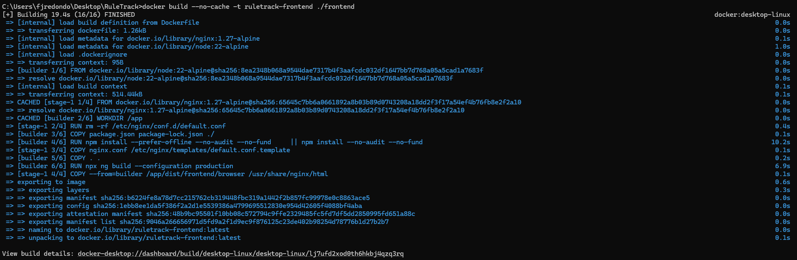
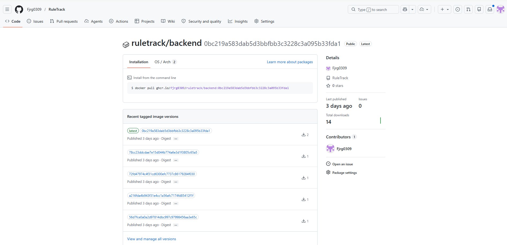
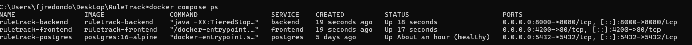
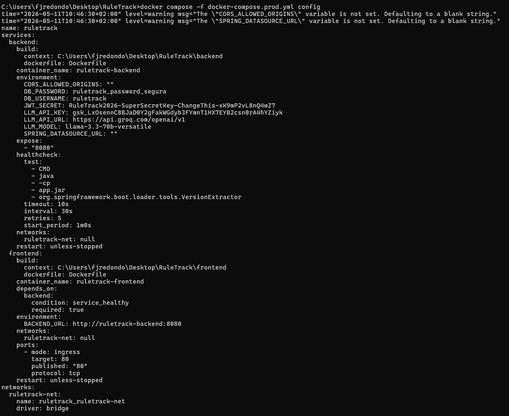
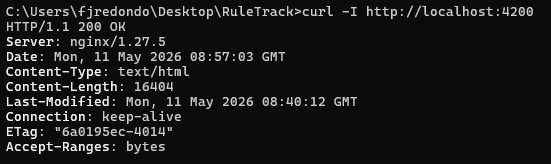
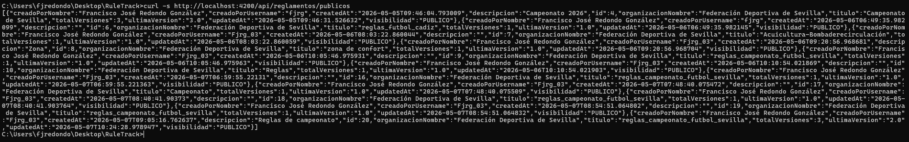
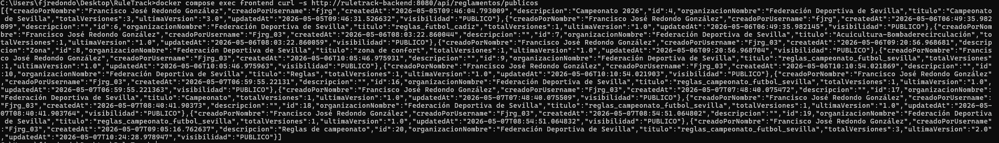
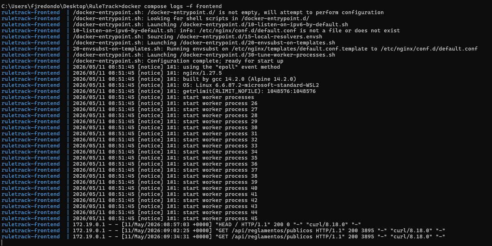
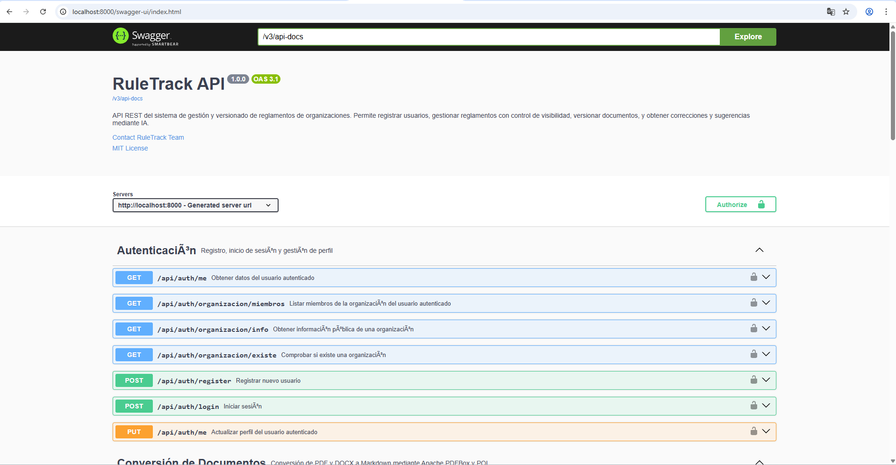

# 08-eval. Despliegue — Criterios de evaluación

> Documento complementario a [08-despliegue.md](08-despliegue.md).
> Cubre los criterios 7 y 8 de evaluación del módulo de despliegue.

---

## Criterio 7 — Gestión de ficheros y artefactos de despliegue

### 7.1 Ficheros clave del despliegue

A continuación se identifican todos los ficheros relevantes para el despliegue de RuleTrack, cómo se generan, dónde se almacenan y cómo se usan.

| Fichero | Ubicación | Cómo se genera | Para qué se usa |
|---|---|---|---|
| `docker-compose.yml` | Raíz del repositorio | Escrito manualmente | Orquesta los tres servicios (postgres, backend, frontend) en desarrollo |
| `docker-compose.prod.yml` | Raíz del repositorio | Escrito manualmente | Orquesta backend y frontend en producción. No expone el backend al exterior |
| `.env` | Raíz del repositorio (no en git) | Copiado de `.env.example` y editado | Inyecta las variables de entorno sensibles en los contenedores |
| `.env.example` | Raíz del repositorio | Escrito manualmente | Plantilla pública de referencia para configurar `.env` |
| `backend/Dockerfile` | `backend/` | Escrito manualmente | Build multi-stage: compila el JAR y genera la imagen final con solo el JRE |
| `frontend/Dockerfile` | `frontend/` | Escrito manualmente | Build multi-stage: compila Angular y genera la imagen final con Nginx |
| `frontend/nginx.conf` | `frontend/` | Escrito manualmente | Configuración de Nginx: sirvе la SPA y hace reverse proxy al backend |
| `backend/target/ruletrack-*.jar` | `backend/target/` (local) | `mvn package` o etapa `build` del Dockerfile | JAR ejecutable de Spring Boot; se copia a la imagen final del backend |
| `frontend/dist/` | `frontend/dist/` (local) | `ng build --configuration production` o etapa `build` del Dockerfile | Bundle estático Angular; se copia a la imagen final de Nginx |
| Imagen `backend:latest` | GHCR (`ghcr.io/<repo>/backend`) | GitHub Actions en cada push a `main` | Imagen Docker lista para desplegar el backend en cualquier servidor |
| Imagen `frontend:latest` | GHCR (`ghcr.io/<repo>/frontend`) | GitHub Actions en cada push a `main` | Imagen Docker lista para desplegar el frontend en cualquier servidor |

---

### 7.2 Cómo se genera el JAR del backend

El JAR se produce dentro del propio Dockerfile en la etapa `build`, sin necesidad de ejecutar Maven manualmente en el servidor:

```dockerfile
# Etapa 1 – compilación
FROM maven:3.9-eclipse-temurin-21 AS build
WORKDIR /app
COPY pom.xml .
RUN mvn dependency:go-offline -B
COPY src ./src
RUN mvn package -DskipTests -B

# Etapa 2 – imagen final
FROM eclipse-temurin:21-jre
WORKDIR /app
COPY --from=build /app/target/*.jar app.jar
ENTRYPOINT ["java", "-jar", "app.jar"]
```



---

### 7.3 Cómo se genera el bundle del frontend

El bundle Angular se genera en la etapa `build` del Dockerfile del frontend:

```dockerfile
# Etapa 1 – compilación Angular
FROM node:22-alpine AS build
WORKDIR /app
COPY package*.json ./
RUN npm ci
COPY . .
RUN npx ng build --configuration production

# Etapa 2 – imagen final Nginx
FROM nginx:1.27-alpine
COPY --from=build /app/dist/frontend/browser /usr/share/nginx/html
COPY nginx.conf /etc/nginx/templates/default.conf.template
```



---

### 7.4 Dónde se almacenan las imágenes

Las imágenes Docker se publican automáticamente en **GitHub Container Registry (GHCR)** mediante el pipeline CI/CD (`.github/workflows/ci.yml`), con doble etiqueta:

- `ghcr.io/<usuario>/<repo>/backend:latest`
- `ghcr.io/<usuario>/<repo>/backend:<sha-del-commit>`
- `ghcr.io/<usuario>/<repo>/frontend:latest`
- `ghcr.io/<usuario>/<repo>/frontend:<sha-del-commit>`

La etiqueta por SHA permite volver a cualquier versión anterior exacta de la imagen.



---

### 7.5 Cómo se usan los artefactos en el servidor

En el servidor de producción, el proceso es:

```bash
# 1. Clonar el repositorio (solo la primera vez)
git clone https://github.com/<usuario>/ruletrack.git
cd ruletrack

# 2. Configurar variables de entorno
cp .env.example .env
# editar .env con los valores reales

# 3. Arrancar la aplicación con Docker Compose
docker compose -f docker-compose.prod.yml up -d --build

# 4. Verificar que los contenedores están en ejecución
docker compose -f docker-compose.prod.yml ps
```

Si las imágenes ya están publicadas en GHCR y no se quiere recompilar en el servidor, se puede usar `docker pull` directamente.



---

### 7.6 El fichero `.env`

El fichero `.env` nunca se sube al repositorio (está en `.gitignore`). Se gestiona manualmente en el servidor. Variables obligatorias:

```env
DB_USERNAME=ruletrack
DB_PASSWORD=contraseña_segura_aqui
JWT_SECRET=secreto-minimo-32-caracteres-generado-aleatoriamente
LLM_API_KEY=api_key_del_proveedor_llm
LLM_API_URL=https://api.groq.com/openai/v1
LLM_MODEL=llama-3.3-70b-versatile
BACKEND_URL=http://ruletrack-backend:8080
CORS_ALLOWED_ORIGINS=http://localhost
```



---

## Criterio 8 — Verificación de red del despliegue

### 8.1 Topología de red

```
Internet
    |
    | :80 (producción) / :4200 (desarrollo)
    v
+------------------+
|   frontend       |   Nginx 1.27-alpine
|   (único punto   |   Sirve los ficheros estáticos Angular
|    de entrada)   |   Reenvía /api/* → backend:8080
+------------------+
    |   Red interna Docker: ruletrack-net
    | :8080 (solo interno)
    v
+------------------+
|   backend        |   Spring Boot 4 / Java 21
|                  |   API REST
|                  |   Puerto 8080 NO expuesto al exterior
+------------------+
    |
    | :5432 (solo interno)
    v
+------------------+
|   postgres       |   PostgreSQL 16
|                  |   Puerto 5432 NO expuesto en producción
+------------------+
```

### 8.2 Puertos publicados

| Entorno | Servicio | Puerto externo | Puerto interno | Expuesto al exterior |
|---|---|---|---|---|
| Desarrollo | `frontend` | `4200` | `80` | Sí |
| Desarrollo | `backend` | `8000` | `8080` | Sí (solo dev) |
| Desarrollo | `postgres` | `5432` | `5432` | Sí (solo dev) |
| Producción | `frontend` | `80` | `80` | Sí |
| Producción | `backend` | — | `8080` | No (solo red interna) |
| Producción | `postgres` | — | `5432` | No (solo red interna) |

> En producción, el backend y PostgreSQL no tienen puertos publicados al exterior. Solo Nginx es accesible desde fuera.

---

### 8.3 Rutas principales y comportamiento de Nginx

Nginx actúa como reverse proxy según estas reglas:

| Ruta | Destino | Descripción |
|---|---|---|
| `/` | Ficheros estáticos en `/usr/share/nginx/html` | Sirve la SPA Angular |
| `/api/*` | `http://ruletrack-backend:8080/api/*` | Reenvía al backend |
| `/swagger-ui/*` | `http://ruletrack-backend:8080/swagger-ui/*` | Documentación API |
| `/v3/*` | `http://ruletrack-backend:8080/v3/*` | Spec OpenAPI (JSON) |
| Cualquier otra ruta | `index.html` | Fallback SPA para enrutado Angular |

---

### 8.4 Comprobaciones de red paso a paso

#### 8.4.1 Verificar que Nginx responde

```bash
curl -I http://localhost
```

Respuesta esperada:

```
HTTP/1.1 200 OK
Server: nginx/1.27.x
Content-Type: text/html
```



---

#### 8.4.2 Verificar el reverse proxy hacia el backend

```bash
# Endpoint público sin autenticación
curl -s http://localhost/api/reglamentos/publicos
```

Respuesta esperada: array JSON (puede estar vacío `[]` si no hay reglamentos creados).

```bash
# Spec OpenAPI a través del proxy
curl -s http://localhost/v3/api-docs | python -m json.tool | head -20
```



---

#### 8.4.3 Verificar la comunicación interna entre contenedores

```bash
# Desde el contenedor del frontend, comprobar que el backend es accesible
docker compose exec frontend curl -s http://ruletrack-backend:8080/api/reglamentos/publicos
```



---

#### 8.4.4 Verificar el estado de los contenedores

```bash
docker compose -f docker-compose.prod.yml ps
```

Salida esperada:

```
NAME                   IMAGE               STATUS          PORTS
ruletrack-backend      ...                 Up              (sin puertos externos)
ruletrack-frontend     ...                 Up              0.0.0.0:80->80/tcp
```


---

#### 8.4.5 Verificar los logs de red en Nginx

```bash
# Ver peticiones entrantes en tiempo real
docker compose logs -f frontend
```



---

#### 8.4.6 Acceso a Swagger UI

Abrir en el navegador:

```
http://localhost/swagger-ui.html
```

Debe cargar la interfaz interactiva de Swagger con todos los endpoints de la API agrupados por recurso.



---

### 8.5 Resolución DNS interna de Docker

Los contenedores se comunican usando sus nombres de servicio definidos en el `docker-compose.yml`, que Docker resuelve automáticamente dentro de la red `ruletrack-net`:

| Nombre DNS interno | Resuelve a | Usado por |
|---|---|---|
| `ruletrack-backend` | IP interna del contenedor backend | Nginx (reverse proxy) |
| `postgres` | IP interna del contenedor postgres | Backend (JDBC URL) |

Esta resolución es gestionada por el demonio Docker y no requiere configuración adicional de DNS externo.
