# 09. Manual de usuario

## 9.1 Introducción

RuleTrack es una aplicación web para gestionar reglamentos con versionado, control de visibilidad y asistencia por inteligencia artificial. Este manual describe las funcionalidades principales según el tipo de usuario.

**URL de acceso**: la aplicación está disponible en el navegador sin necesidad de instalar nada.

**Navegadores compatibles**: Chrome, Firefox, Edge, Safari (versiones modernas).

---

## 9.2 Tipos de usuario

| Tipo | Descripción |
|---|---|
| **Usuario externo** | Accede sin cuenta. Solo puede consultar reglamentos públicos. |
| **Usuario miembro** | Registrado en una organización. Consulta reglamentos públicos y de miembros. |
| **Organizador** | Crea y gestiona reglamentos, versiones, conversiones y análisis IA. |

---

## 9.3 Registro e inicio de sesión

### Registrarse

1. Acceder a la aplicación.
2. Pulsar el botón **Registrarse** en la cabecera o en la pantalla principal.
3. Rellenar el formulario:
   - **Nombre de usuario** (único en el sistema).
   - **Nombre y apellidos**.
   - **Fecha de nacimiento** (los organizadores deben ser mayores de 18 años).
   - **Email** (único en el sistema).
   - **DNI** (único en el sistema).
   - **Contraseña**.
   - **Organización**: elegir entre unirse a una existente (introducir su nombre exacto) o crear una nueva.
   - **Rol**: USUARIO o ORGANIZADOR.
4. Pulsar **Crear cuenta**.
5. Al completarse el registro, se inicia sesión automáticamente.

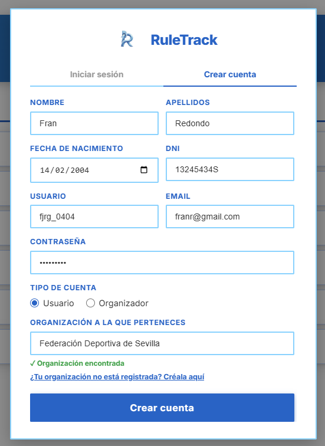

### Iniciar sesión

1. Pulsar el botón **Iniciar sesión** en la cabecera.
2. Introducir **nombre de usuario** y **contraseña**.
3. Pulsar **Entrar**.
4. La aplicación redirige al panel correspondiente al rol del usuario.

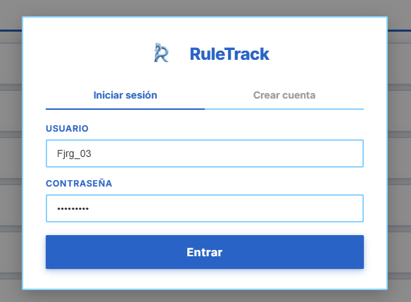

### Cerrar sesión

Pulsar el icono de usuario en la cabecera y seleccionar **Cerrar sesión**.

---

## 9.4 Panel principal

### Panel de usuario (`/`)

La pantalla de inicio muestra los **reglamentos visibles** para el usuario autenticado:
- Reglamentos públicos de cualquier organización.
- Reglamentos de la propia organización con visibilidad `SOLO_MIEMBROS`.

Cada fila muestra el título del reglamento, su badge de visibilidad y un botón **Descargar** para obtener el documento en formato Markdown o PDF.

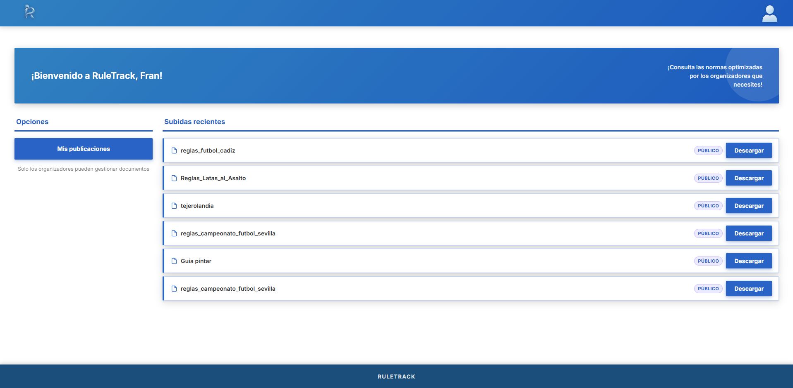

### Panel de organizador (`/`)

El organizador accede al mismo panel de inicio pero con opciones adicionales en la barra lateral:
- **Mi organización**: información de la organización.
- **Mis publicaciones**: gestión de reglamentos.
- **Usuarios de mi organización**: lista de miembros.

El área principal muestra las **subidas recientes** con badges de visibilidad (PÚBLICO, SOLO MIEMBROS, PRIVADO). En la parte inferior aparece el botón **Subir archivo** para iniciar una nueva conversión.

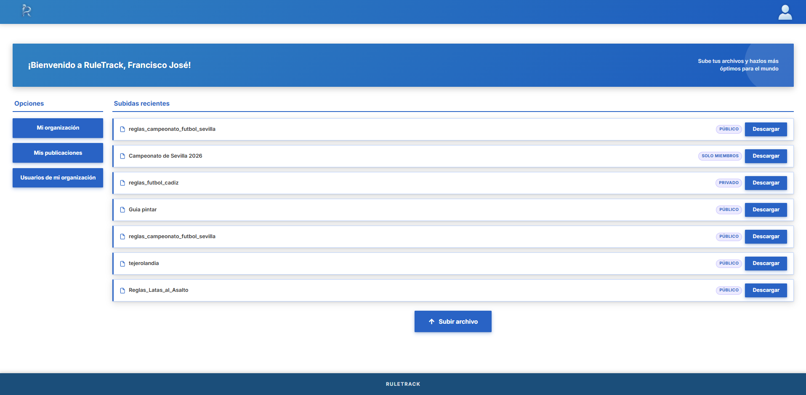

---

## 9.5 Gestión de reglamentos (Organizador)

### Ver lista de reglamentos (`/publicaciones`)

Muestra todos los reglamentos de la organización en una tabla con columnas: **Nombre**, **Versión**, **Estado**, **URL** y **Acciones**. Por cada reglamento hay dos botones de acción:
- **Icono de copiar**: copia la URL pública del reglamento al portapapeles.
- **Icono de ojo**: accede a la página de ajustes de publicación del reglamento.

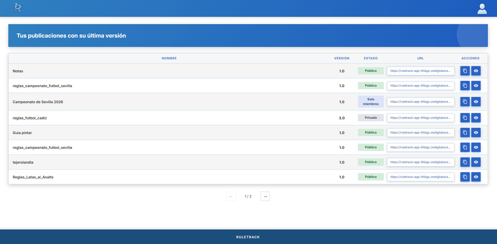

### Crear un nuevo reglamento

**Opción A – Desde cero:**

1. Desde el panel de organizador, pulsar **Subir archivo** para acceder a `/upload`.
2. Subir un documento PDF o DOCX existente, o escribir el contenido directamente.
3. Si se sube un documento, la aplicación lo convierte automáticamente a Markdown.
4. Revisar el contenido en la pantalla de previsualización (`/preview`).
5. Aplicar correcciones IA si se desea (ver sección 9.7).
6. Configurar título, descripción y visibilidad.
7. Pulsar **Publicar** para crear el reglamento con la versión inicial.

### Editar un reglamento (`/publicaciones`)

1. Desde la tabla de reglamentos dentro de publicaciones, pulsar el **icono de ojo** en el reglamento deseado.
2. En la página de ajustes de publicación, se pueden realizar las siguientes acciones:
   - Modificar título, descripción o visibilidad y pulsar **Guardar cambios**.
   - Actualizar el reglamento con una nueva versión (ver sección 9.6).
   - Eliminar el reglamento pulsando **Borrar publicación** (con confirmación).

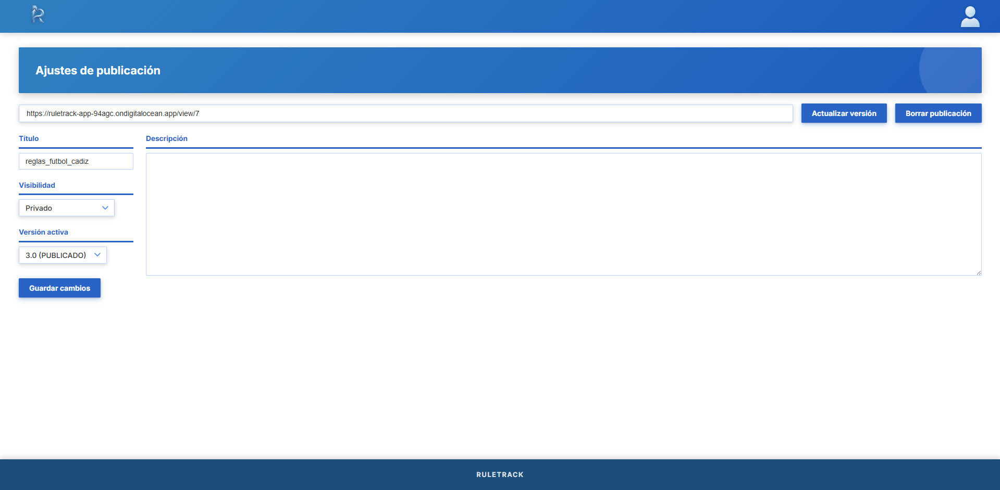
### Configurar visibilidad

| Opción | Quién puede ver el reglamento |
|---|---|
| **PUBLICO** | Cualquier persona, incluso sin cuenta |
| **SOLO_MIEMBROS** | Solo los usuarios de la misma organización |
| **PRIVADO** | Solo el creador |

---

## 9.6 Gestión de versiones (Organizador)

### Ver versiones de un reglamento (`/ajustes-publicacion`)

La página de ajustes de publicación muestra todas las versiones del reglamento con su estado:
- `BORRADOR`: en redacción, no visible para usuarios.
- `PUBLICADO`: versión activa y visible.
- `ARCHIVADO`: versión reemplazada por una posterior.

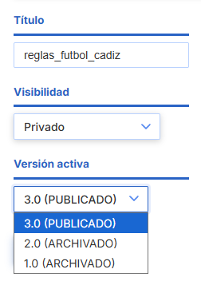

### Crear una nueva versión

1. Desde la página de ajustes de publicación, pulsar **Actualizar versión**.
2. El sistema te mandará a la previsualización del contenido, donde haces clic en "Corregir documento".
3. Se realizan las correcciones y se puede cambiar el nombre de la publicación y la versión del mismo.

### Activar una versión

Al activar una versión:
- Su estado pasa a `PUBLICADO`.
- La versión previamente activa pasa a `ARCHIVADO`.
- Solo puede haber una versión activa por reglamento.

---

## 9.7 Flujo de subida y conversión de documentos

### Subir un documento (`/upload`)

1. Acceder a la página de subida (`/upload`).
2. Arrastrar y soltar un fichero **PDF**, **DOCX**, **TXT** o **Markdown** sobre la zona de carga, o pulsar **Subir desde dispositivo** para usar el explorador de archivos.
3. La conversión se inicia automáticamente al seleccionar el fichero.

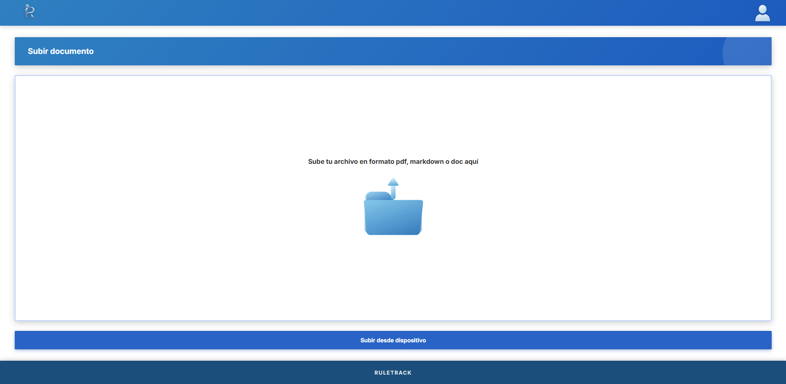

### Conversión (`/converting`)

La aplicación procesa el documento en el servidor:
- **PDF**: extracción de texto con Apache PDFBox.
- **DOCX**: extracción de texto con Apache POI.

La pantalla muestra una animación mientras el servidor convierte el documento a Markdown. Una vez completado, redirige automáticamente a la previsualización.

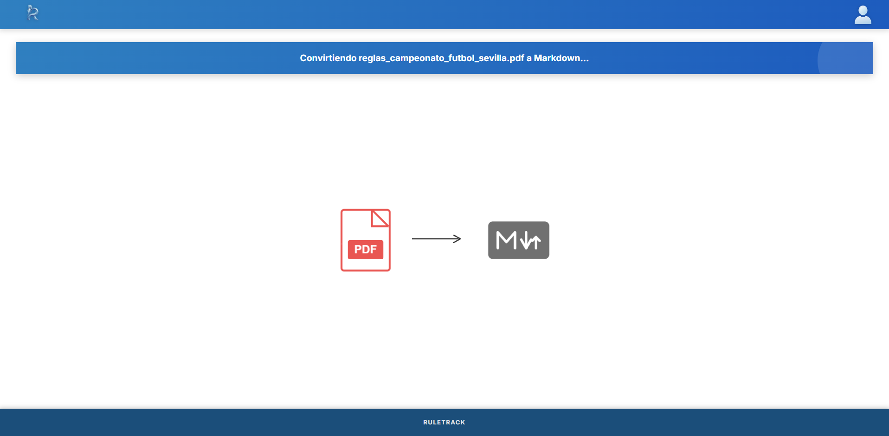

### Previsualización (`/preview`)

Muestra el contenido extraido en texto plano. Desde aquí se puede:
- Revisar el texto extraído del documento.
- Pulsar **Corregir documento** para continuar al análisis IA, o **Volver** para cancelar.

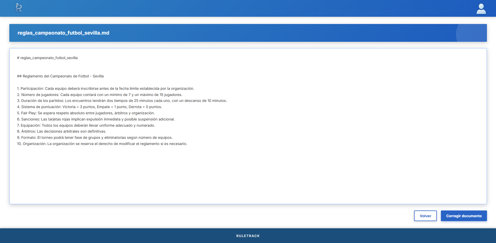

---

## 9.8 Corrección con IA (`/correcting` y `/corrected`)

### Solicitar correcciones

1. Desde la previsualización, pulsar **Corregir documento**.
2. La aplicación envía el contenido al modelo LLM (Groq / OpenAI-compatible).
3. El modelo devuelve entre 5 y 8 sugerencias de corrección en categorías: ortografía, gramática, formalidad y estilo.

### Revisar y aplicar sugerencias (`/correcting`)

La página muestra el documento completo con los fragmentos que el modelo IA sugiere cambiar resaltados. Cada fragmento marcado se puede revisar de dos formas:

**Corrección individual (tooltip):**
- Pasar el cursor sobre cualquier fragmento resaltado abre un tooltip con:
  - El texto original y la sugerencia propuesta.
  - El botón **Aplicar** para aceptar esa corrección concreta.
  - El botón **Rechazar** para descartar esa corrección concreta.
- Una vez aplicada, la palabra se muestra en verde; una vez rechazada, deja de estar marcada.

**Opciones globales (pie de página):**
- **Aplicar correcciones**: acepta todas las sugerencias pendientes de una vez.
- **Ignorar correcciones**: descarta todas las sugerencias y conserva el texto original.

Un contador en la parte superior indica cuántas correcciones quedan pendientes de revisar.

Si el servicio IA no está disponible se muestra un mensaje de error descriptivo con instrucciones para el administrador.

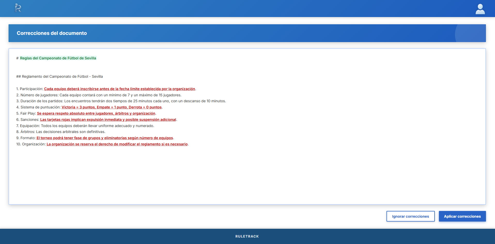

### Publicar el documento (`/corrected`)

Tras revisar las correcciones, la aplicación muestra el formulario de publicación:

- **Nombre del documento**: título que recibirá el reglamento (por defecto, el nombre del fichero original).
- **Versión**: etiqueta semántica de la versión (por defecto `1.0`; formato `X.Y` o `X.Y.Z`). En modo actualización se sugiere automáticamente la siguiente etiqueta.
- **Descripción**: texto libre que describe el contenido del reglamento.
- **Visibilidad**: `PUBLICO`, `SOLO_MIEMBROS` o `PRIVADO`.

Desde esta pantalla se puede:
- Pulsar **Consultar documento** para previsualizar el resultado corregido antes de publicar.
- Pulsar **Publicar** para crear el reglamento (nuevo) o añadir una versión a uno existente.

En modo actualización (accedido desde *Ajustes de publicación*), el nombre y la visibilidad se precargan con los valores actuales del reglamento y solo se crea una nueva versión.

---

### Enlace creado (`/link-created`)

Al completar la publicación, la aplicación muestra una pantalla de confirmación con:

- La **URL pública** del reglamento, lista para copiar y compartir.
- El botón **Ver documento** para abrir directamente la vista de lectura del reglamento.
- El botón **Ajustar acceso** para ir a la página de ajustes de publicación y modificar visibilidad o versiones.
- El botón **Volver a inicio** para regresar al panel principal y limpiar el estado de la subida.

---

## 9.9 Vista de lectura de un reglamento (`/view/:id`)

La página de vista es accesible para cualquier usuario (sin necesidad de cuenta) cuando el reglamento es PUBLICO, y para los miembros autorizados en los demás casos. Se accede desde el enlace compartido o pulsando el título de un reglamento en cualquier listado.

La pantalla se organiza en tres pestañas:

### Pestaña Normas

Muestra el contenido del reglamento en formato Markdown renderizado. Incluye:

- **Tabla de contenidos**: generada automáticamente a partir de los encabezados del documento. Al pulsar un elemento de la tabla se desplaza suavemente hasta la sección correspondiente.
- **Buscador**: campo de texto que resalta en tiempo real todas las coincidencias en el documento e indica el número total de resultados encontrados. Pulsar la `×` limpia la búsqueda.
- **Botón de descarga**: abre un modal para descargar el reglamento en formato **Markdown** o **PDF** (generado en el navegador con jsPDF).

### Pestaña Resumen

Genera y muestra un resumen estructurado del reglamento usando el modelo LLM configurado. El resumen se carga de forma diferida la primera vez que se accede a la pestaña y se organiza en secciones con puntos clave. Si la generación falla, se muestra un botón **Reintentar**.

### Pestaña Historial

Muestra el historial de versiones publicadas del reglamento. Al seleccionar una versión del desplegable se presenta un **visor de diferencias** línea a línea respecto a la versión anterior:

- Las líneas **añadidas** aparecen en verde con el prefijo `+`.
- Las líneas **eliminadas** aparecen en rojo con el prefijo `−`.
- Las líneas sin cambios se condensan. Si no hay versión anterior disponible, o se activa **Mostrar contenido completo**, se muestra el documento íntegro de esa versión.

---

## 9.10 Perfil y organización

### Ver perfil (`/perfil`)

Muestra los datos del usuario autenticado: nombre completo, fecha de nacimiento, organización y nick. Desde esta página se puede acceder a las publicaciones propias mediante el botón **Publicaciones**.

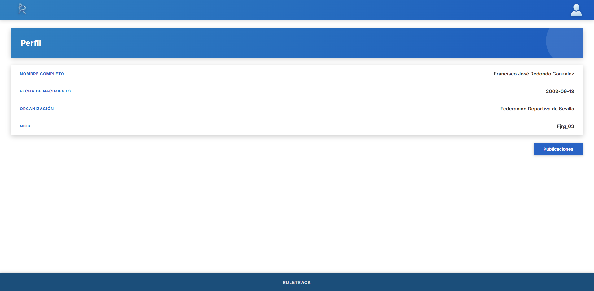

### Editar perfil

La edición de nombre y email se realiza desde la página de **Ajustes** (`/ajustes`), sección "Información personal". Modificar los campos deseados y pulsar **Actualizar perfil**.

### Preferencias (`/ajustes`)

La sección **Preferencias** de la página de ajustes permite:

- **Modo oscuro**: activa o desactiva el tema oscuro de la interfaz. La preferencia se guarda en el navegador y se aplica automáticamente en futuras visitas.
- **Idioma**: muestra el idioma actual de la aplicación (actualmente solo Español).

### Notificaciones (`/ajustes`)

La sección **Notificaciones** permite activar o desactivar de forma independiente:

- **Novedades**: alertas sobre actualizaciones de la plataforma.
- **Emails**: notificaciones por correo electrónico.

### Zona de peligro (`/ajustes`)

Al pie de la página de ajustes se encuentra la sección de acciones irreversibles:

- **Cerrar sesión**: finaliza la sesión del usuario y redirige a la página principal.
- **Eliminar cuenta**: muestra un diálogo de confirmación antes de proceder. La acción cierra la sesión inmediatamente.

### Ver miembros de la organización (`/miembros-organizacion`)

Lista todos los usuarios registrados en la misma organización, separados en dos columnas: **Organizadores** y **Usuarios**, con nombre de usuario, nombre completo y badge de rol.

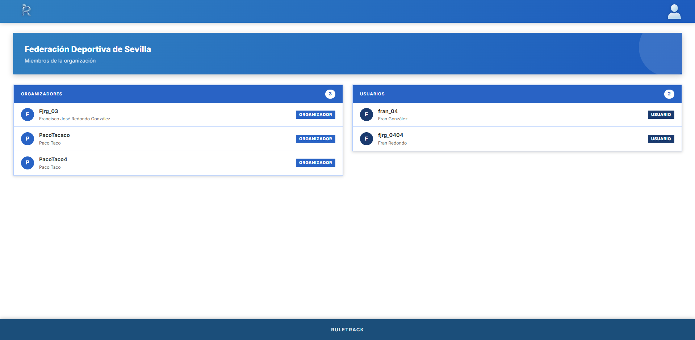

### Información de la organización (`/organizacion`)

Muestra el nombre de la organización, fecha de fundación, número de organizadores y número total de miembros.

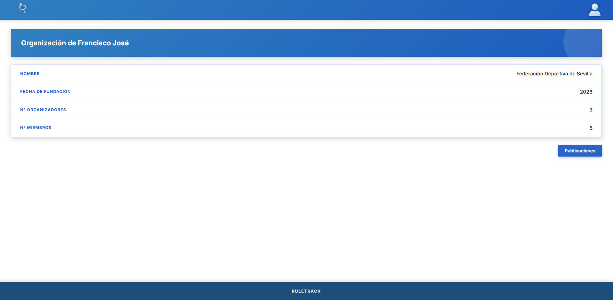

---

## 9.11 Preguntas frecuentes

**¿Puedo acceder a los reglamentos sin registrarme?**
Sí, los reglamentos con visibilidad PUBLICO son accesibles sin cuenta desde su URL directa o desde la página principal.

**¿Qué formatos de documento puedo subir?**
PDF, DOCX, TXT y Markdown (.md). El tamaño máximo es 10 MB.

**¿Por qué no funciona el análisis IA?**
La funcionalidad IA requiere que el administrador del sistema haya configurado una `LLM_API_KEY` válida. Si el análisis falla, contacta con el administrador.

**¿Puedo recuperar una versión archivada?**
Sí. Desde la lista de versiones, puedes activar cualquier versión archivada, lo que la volverá a publicar y archivará la actual.

**¿Puedo eliminar un reglamento?**
Sí, siempre que seas el organizador propietario. La eliminación es permanente e incluye todas sus versiones, sugerencias e historial.

**¿Cómo sé qué versión está activa?**
La versión con estado PUBLICADO es la activa. Solo puede haber una por reglamento. Se muestra destacada en la lista de versiones.

**¿Qué ocurre si subo un PDF escaneado (solo imágenes)?**
El proceso de conversión extrae únicamente texto digital. Los PDFs escaneados sin OCR producirán un resultado vacío o muy limitado. Se recomienda usar documentos con texto seleccionable.